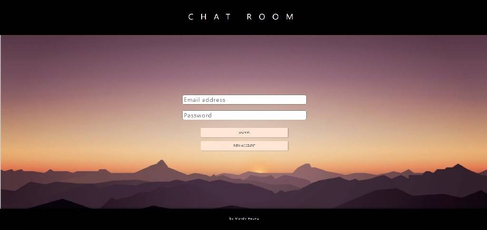
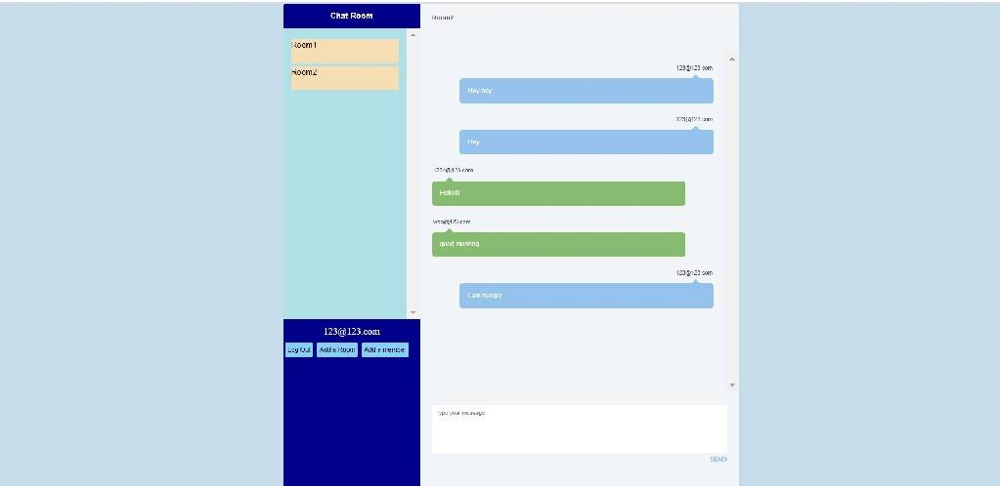
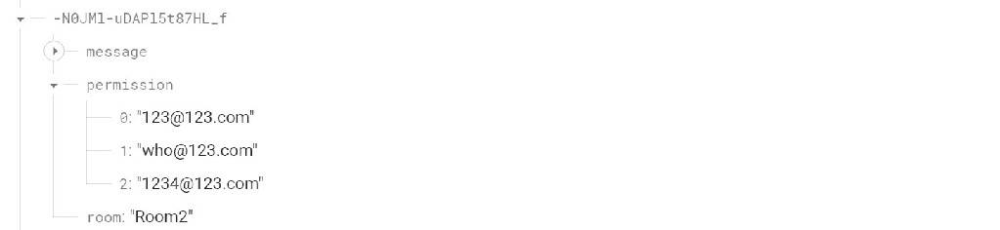
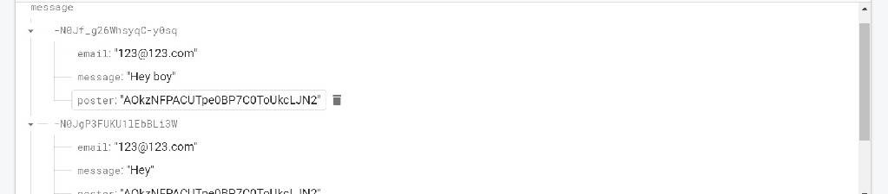

# Software Studio 2022 Spring Midterm Project
*Student Id: 109062224*
### Scoring

| **Basic components**                             | **Score** | **Check** |
| :----------------------------------------------- | :-------: | :-------: |
| Membership Mechanism                             | 15%       | Y         |
| Firebase page                                    | 5%        | Y         |
| Database read/write                              | 15%       | Y         |
| RWD                                              | 15%       | Y         |
| Chatroom                                         | 20%       | Y         |

| **Advanced tools**                               | **Score** | **Check** |
| :----------------------------------------------- | :-------: | :-------: |
| Using React                                      | 10%       | Y         |
| Third-Party Sign In                              | 1%        | Y     |
| Notification                                     | 5%        | Y         |
| CSS Animation                                    | 2%        | Y         |
| Security                                         | 2%        | Y         |

| **Other useful functions**                         | **Score** | **Check** |
| :----------------------------------------------- | :-------: | :-------: |
| Name of functions                                  | 1~10%     | N         |


---

### How to use 

- 登入介面:

    - 已註冊：輸入郵件跟密碼，然後點選sign in，登入成功會顯示success且跳轉至聊天室介面。
    - 未註冊：輸入郵件跟密碼，然後點選new account。如果格式不符合規定會跳出對應的錯誤訊息，註冊成功後會自動登入。
- 聊天室：

    - 左側為該用戶擁有的聊天室，點選可以進行切換。下方顯示當前用戶的郵件作為用戶名稱，三個按鈕由左至右分別為登出、新增聊天室、新增聊天室成員。
    - 右側為當前聊天室訊息。初始為空，需要先選擇一個聊天室才能查看內容。上方顯示當前聊天室名稱，下方可以輸入訊息。
    - 新增聊天室會要求輸入聊天室名稱。
    - 新增聊天室成員：輸入某用戶的郵件來將該用戶加入聊天室。（該用戶若本來為上線狀態需要重新登入才看的到新的聊天室。）
    - 擁有該聊天室的權限才能讀取聊天室的訊息（包含歷史訊息）以及傳送訊息。

### Function description
- index(root)
    - SignIn
    - Home
        - RoomItem
        - MessageList
            - messageItem
- 在index.js中會透過 **authenticated** 去判斷目前的登入狀態，尚未登入的話會回傳SignInPage（登入介面），登入後回傳Home（聊天室介面）
- SignInPage：將使用者輸入的郵件和密碼傳回去給root的函式，在root完成登入或是註冊後更新state：**authenticated**，畫面便會自動重新渲染，，而此時 **authenticated**已被更改為true，所以會回傳聊天室介面。而達到切換頁面的效果。
- 顯示聊天室
    - Home.js的componentDidMount()會在該class建構完組件的時候被執行，去讀取firebase.database裡面的資料，檢查該節點的permission成員是否有和目前用戶的郵件相同的，確認該用戶擁有此聊天室的權限後將該聊天室的名稱跟key加入roomlist。檢查完所有聊天室後一次更新state：**roomList**，重新render後便會看到該用戶擁有的聊天室出現在左側。
    ```javascript
    componentDidMount() {
    let keyname = [];
    var Ref = firebase.database().ref("chatroom");
    Ref.once("value", (snapshot) => {
      snapshot.forEach((childSnapshot) => {
        var childKey = childSnapshot.key;
        var childData = childSnapshot.val();
        ...
        //檢查是否擁有該聊天室權限//
        ...
      });
      this.setState({ roomList: [...keyname] });
    });
  }
    ```
    - 透過roomList去建構RoomItem component
    ```javascript
        {this.state.roomList.map((item, index) => {
            return (
                <RoomItem
                  key={index}
                  idx={index}
                  name={item.name}
                  roomkey={item.roomkey}
                  selectRoom={this.selectRoom}
                />
              );
            })}
    ```
    - 當RoomItem被點擊會觸發selectRoom事件，RoomItem會回傳name跟key回去給位於Home.js的函式，更新state：**currentRoom**，render後右上方顯示目前的聊天室名稱，並且透過MessageList component去顯示聊天室訊息。

- 顯示當前聊天室訊息：
    - MessageList.js中使用componentDidUpdate()且設定是currentRoom有變化時才觸發。將**currentRoom.roomkey**加在路徑上我們可以進到firebase.database中我們想查看的那個聊天室裡面。把每則訊息的內容及寫入者加入**chats**，更新state後render回MessageItem component，即可在聊天室中看見訊息。
    ```javascript
        componentDidUpdate(prevProps) {
            if (this.props.currentRoom.roomkey != prevProps.currentRoom.roomkey) {
                var Ref = firebase.database().ref("chatroom/" + this.props.currentRoom.roomkey + "/message");
                Ref.on("value", (snapshot) => {
                let read = [];
                snapshot.forEach((childSnapshot) => {
                    var childKey = childSnapshot.key;
                    var childData = childSnapshot.val();
                    read.push({message: childData.message, poster: childData.email});
                });
                this.setState({ chats: [...read] });
            });
        }
    }
    ```
    - 訊息串：透過chats去建構MessageItem，並根據poster判斷訊息是自己發出去的還是別人發的來決定訊息樣式。
    ```javascript
        return (
        <div>
            {this.state.chats.map((item, index) => {
            return (
                <MessageItem 
                    key={index} 
                    idx={index} 
                    info={item.message} 
                    poster={item.poster} 
                    user={user.email}
                >
            </MessageItem>
          );
        })}
      </div>
    );
    ```
- 傳送訊息
    - 在Home.js中 handleChange會去讀取輸入框中的文字並更新到state：**content**裡面，當按下submit，觸發handleSubmit()去把content的內容寫入firebase.database。
    ```javascript
    handleSubmit(event) {
    var post_data = {
      poster: this.state.user.uid,
      message: this.state.content,
      email: this.state.user.email,
    };

    firebase
      .database()
      .ref("chatroom/" + this.state.currentRoom.roomkey + "/message")
      .push(post_data);
    this.setState({ content: "" });
  }
  ```
- database內部儲存格式

    - chatroom底下存放的節點為一個獨立的聊天室，記錄訊息(message)、有存取權的成員(permission)、聊天室名稱(room)

    - 聊天室的message底下存放的節點為一個獨立的訊息，記錄發送者uid(poster)、發送者郵件(email)、訊息內容(message)

- 增加聊天室成員
    - 如果目前不在任何一個聊天室，會發送警告提醒用戶先選一個聊天室。
    - handleAddMember()從用戶端得到一組email，將他加入當前聊天室(currentRoom)的permission中
- 創建新的聊天室
    - handleAddRoom()從用戶端得到一個room name，將這個room name和目前使用者的email(加入permission)寫入database，並記錄那個新分支(room)的key，把新的room的資訊加到roomList，更新state：**roomList**，左側的聊天室RoomItem被重新建置，可以看到多了一個聊天室出來。
- 登出
    - 當logout button被觸發，呼叫root的函式handleLogOut()，使用firebase.auth().signOut()成功登出後，更新state：**authenticated**，重新渲染頁面跳回登入介面。
### Firebase page link

    Your web page URL

### Others (Optional)

    Anything you want to say to TAs.

<style>
table th{
    width: 100%;
}
</style>